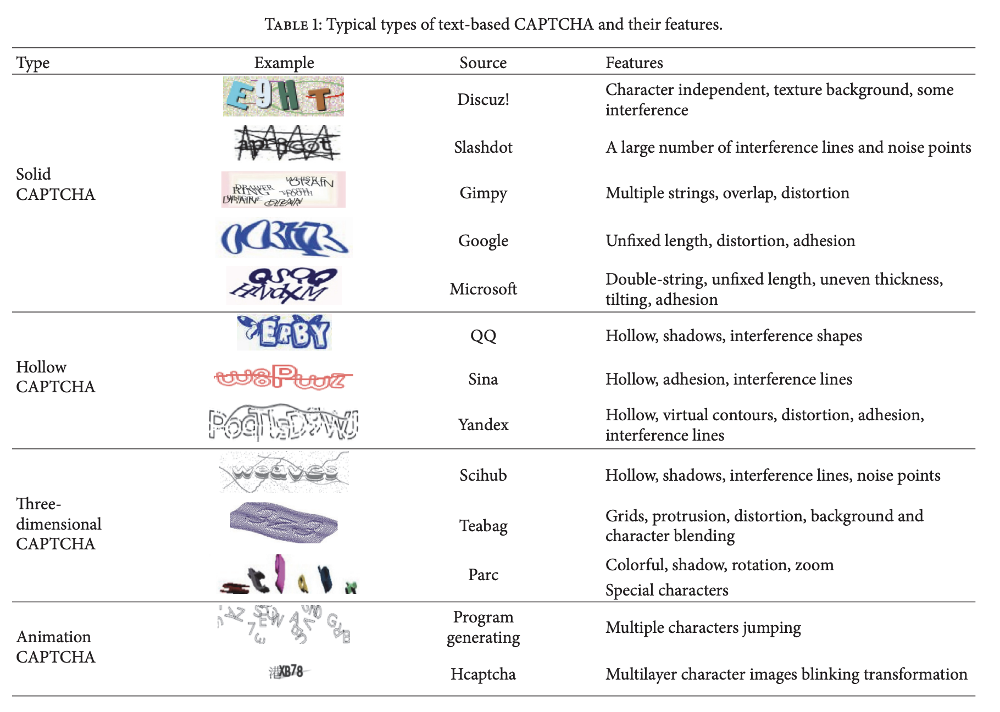
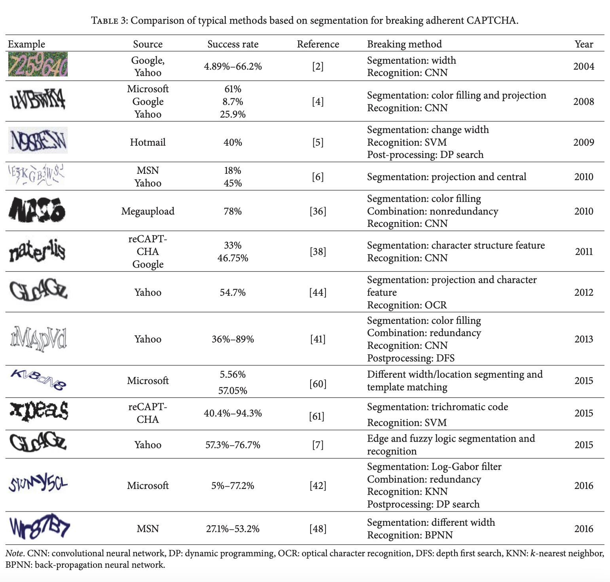
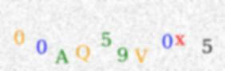
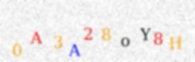
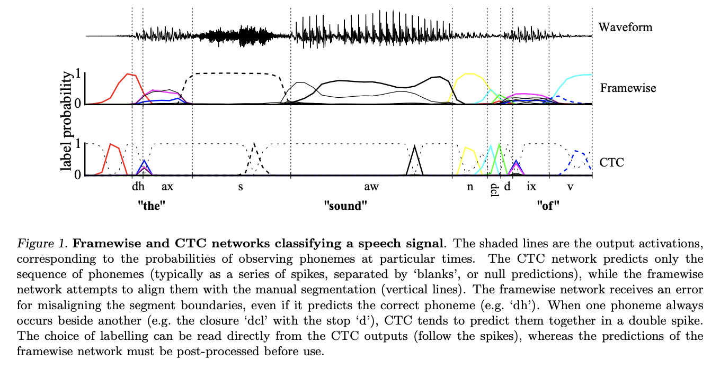
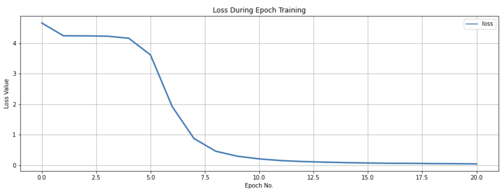

# Captcha-Breaker-project

---

### Project on Breaking Captcha after recognising it

Text-based CAPTCHA has become one of the most popular methods for preventing bot attacks. With the rapid development of deep learning techniques, many new methods to break text-based CAPTCHAs have been developed in recent years. However, a holistic and uniform investigation and comparison of these attacks’ effects is lacking due to inconsistent choices of model structures, training datasets, and evaluation metrics.

### Types of Text-based Captcha:

### Some methods of breaking them:

### Dataset sample images: 
      
Label : 00AQ59V0x5
      
Label : 0A3A28oY8H

### Web-app file as app.py: [app.py](https://github.com/Pushkar1853/Captcha-Breaker-project/blob/1bd8969b3592a959fa0d69a06e13bfd84ffaf98e/webapp/webapp.py)
### Final notebook : [notebook](https://github.com/Pushkar1853/Captcha-Breaker-project/blob/1bd8969b3592a959fa0d69a06e13bfd84ffaf98e/notebook/captcha-recognition-project.ipynb)
### Check out scripts and source codes below: [src](https://github.com/Pushkar1853/Captcha-Breaker-project/tree/791359bf94bb2c7694e06cd86485671c9d5d5968/src) and [scripts](https://github.com/Pushkar1853/Captcha-Breaker-project/tree/791359bf94bb2c7694e06cd86485671c9d5d5968/scripts)

<b>Note : </b>
The final notebook mentions the working of the model as well as the reduction in CTC loss.

### CTC Loss defintion:
A Connectionist Temporal Classification Loss, or CTC Loss, is designed for tasks where we need alignment between sequences, but where that alignment is difficult - e.g. aligning each character to its location in an audio file. It calculates a loss between a continuous (unsegmented) time series and a target sequence. It does this by summing over the probability of possible alignments of input to target, producing a loss value which is differentiable with respect to each input node.

### CTC Loss on the dataset:

### Website deployed:

https://huggingface.co/spaces/PushkarA07/Captcha-breaker-project

### Papers followed:
* https://www.researchgate.net/publication/322048189_A_Survey_on_Breaking_Technique_of_Text-Based_CAPTCHA
* https://ietresearch.onlinelibrary.wiley.com/doi/epdf/10.1049/ise2.12047
* https://dl.acm.org/doi/10.1145/3559754
* https://www.cs.toronto.edu/~graves/icml_2006.pdf
